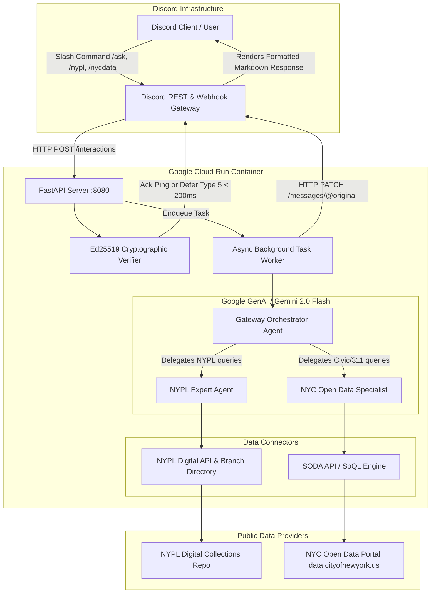

# Architecture & Agent-to-Agent (A2A) Guide 🏛️🧠

This document details the architectural design, agent hierarchy, tool execution patterns, and Discord interaction lifecycle of the **NYC & NYPL Discord Assistant**.

---

## 🏛️ System Architecture



---

## 🧠 Agent-to-Agent (A2A) Hierarchy

The system follows an **Agentic Delegation Pattern** using Google's `google-genai` SDK and **Gemini 2.0 Flash**:

### 1. Gateway Orchestrator Agent ([`orchestrator.py`](file:///home/jayh/Documents/nypl_discord_bot/app/agents/orchestrator.py))
- **Role**: High-level triage, intent classification, multi-domain routing, and response synthesis.
- **Model**: `gemini-2.0-flash` (Temperature: 0.2).
- **Delegation Tools**:
  - `delegate_to_nyc_data_agent`: Routes questions about 311 complaints, restaurant sanitation, street trees, or city metrics.
  - `delegate_to_nypl_agent`: Routes questions about NYPL digital archives, public domain photos, maps, manuscripts, or research centers.
- **Multi-Domain Synthesis**: If a query involves both domains (e.g. *"What are the 311 noise complaints near the historic Schwarzman library building?"*), the orchestrator calls both expert agents in parallel and combines the findings into a cohesive, structured answer.

### 2. NYPL Expert Agent ([`nypl_agent.py`](file:///home/jayh/Documents/nypl_discord_bot/app/agents/nypl_agent.py))
- **Role**: Domain specialist in the New York Public Library's public domain archives and branch locations.
- **Tools**:
  - `search_nypl_digital_collections`: Searches public domain photographs, maps, prints, and digitized manuscripts via NYPL's API.
  - `find_nypl_branch`: Searches NYPL research centers (Schwarzman, Schomburg, Library for the Performing Arts, SNFL) and borough locations.

### 3. NYC Open Data Specialist ([`nyc_data_agent.py`](file:///home/jayh/Documents/nypl_discord_bot/app/agents/nyc_data_agent.py))
- **Role**: Urban data engineer specializing in Socrata Open Data API (SODA) and SoQL query formation.
- **Tools**:
  - `query_nyc_311`: Queries real-time NYC 311 service request complaints (noise, parking, heat/hot water, sanitation, traffic).
  - `query_restaurant_inspections`: Queries NYC DOHMH restaurant inspection scores, grades (A, B, C), and violation descriptions.
  - `query_tree_census`: Queries NYC Parks 2015 Street Tree Census data across boroughs.

---

## ⚡ The Discord 3-Second Rule & Deferral Flow

Discord enforces a strict **3.0-second timeout** for HTTP slash command webhooks. If the bot does not return an HTTP 200 response within 3 seconds, Discord displays `"The application did not respond"`.

Because complex LLM reasoning and remote API queries often take 2–6 seconds, we utilize Discord's **Deferred Message Response Pattern**:

```text
Sequence of Events:
1. User invokes /ask in Discord.
2. Discord POSTs interaction to /interactions.
3. [T + 0.05s] FastAPI validates Ed25519 signature.
4. [T + 0.10s] FastAPI returns HTTP 200 with {"type": 5} (DEFERRED_CHANNEL_MESSAGE_WITH_SOURCE).
   -> Discord immediately changes user UI to "Bot is thinking...".
5. [T + 0.12s] FastAPI dispatches process_agent_interaction to BackgroundTasks.
6. [T + 0.20s - 3.50s] Gemini Agent runs tool loop and queries SODA / NYPL APIs.
7. [T + 3.60s] Bot sends HTTP PATCH to:
   https://discord.com/api/v10/webhooks/{app_id}/{token}/messages/@original
   with the final markdown response.
8. Discord updates the "Bot is thinking..." message with the full result.
```

---

## 🛠️ Data Connectors: SODA & SoQL Queries

The NYC Open Data portal (`data.cityofnewyork.us`) is powered by Socrata (SODA API). We execute parameterized queries using **SoQL (Socrata Query Language)**:

### Common Endpoints:
| Dataset Name | Resource ID | Description |
| :--- | :--- | :--- |
| **311 Service Requests** | `erm2-nwe9` | Real-time municipal service complaints and inquiries. |
| **Restaurant Inspections** | `43nn-pn8j` | NYC DOHMH health inspection scores and violation history. |
| **Street Tree Census (2015)** | `5rq2-4hqu` | Complete inventory of street trees in all 5 boroughs. |
| **NYPD Crime Complaints** | `5uac-w243` | Historic and year-to-date felony/misdemeanor reports. |

### SoQL Best Practices Implemented:
- **`$select` Projection**: Restricts returned columns to only what is needed, reducing payload size by ~80% and saving LLM context tokens.
- **`$order` Sorting**: Sorts by latest timestamp (e.g. `created_date DESC`, `inspection_date DESC`).
- **`$limit` Capping**: Automatically capped between 1 and 25 records to prevent context explosion.
- **Case Normalization**: Automatically upper-cases borough names (`MANHATTAN`, `BROOKLYN`, `QUEENS`, `BRONX`, `STATEN ISLAND`) to match SODA database schemas.

---

## 🔒 Security: Ed25519 Cryptographic Verification

Discord signs all outgoing webhooks using the **Ed25519 public-key signature system**.
Every request sent to `/interactions` includes:
- `X-Signature-Ed25519`: Hex-encoded cryptographic signature.
- `X-Signature-Timestamp`: Timestamp string of when Discord sent the request.
- Request Raw Body bytes.

Verification is implemented in [`app/discord/security.py`](file:///home/jayh/Documents/nypl_discord_bot/app/discord/security.py) using `PyNaCl`:
```python
from nacl.signing import VerifyKey

def verify_discord_signature(signature: str | None, timestamp: str | None, body: bytes) -> bool:
    if not signature or not timestamp or not settings.DISCORD_PUBLIC_KEY:
        return False
    try:
        verify_key = VerifyKey(bytes.fromhex(settings.DISCORD_PUBLIC_KEY))
        verify_key.verify(f"{timestamp}".encode() + body, bytes.fromhex(signature))
        return True
    except Exception:
        return False
```
Any request that fails verification is immediately rejected with `HTTP 401 Unauthorized`.
