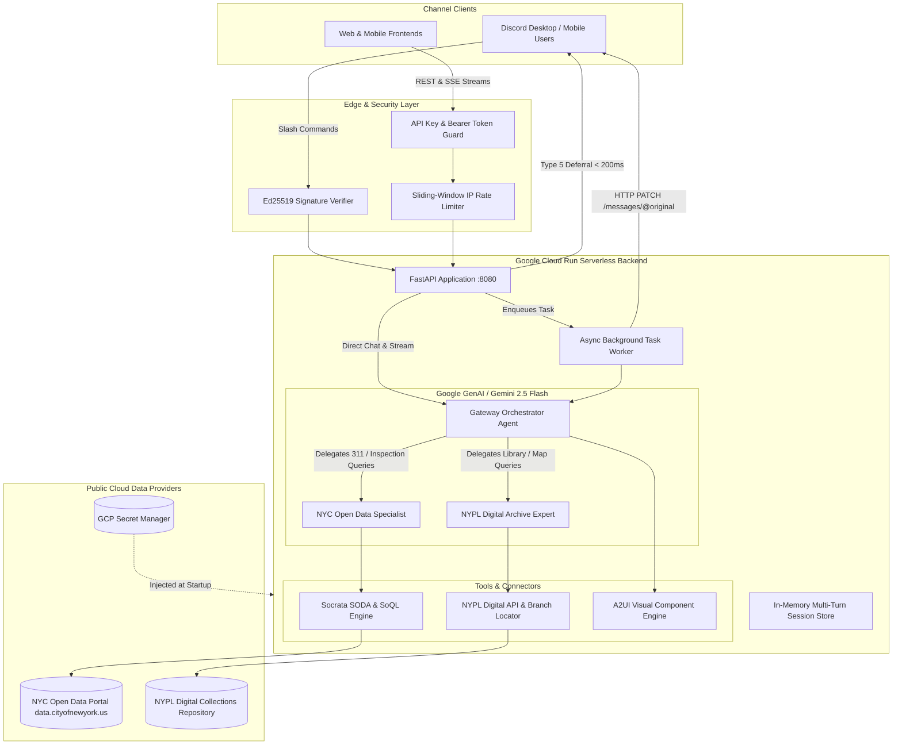

# NYC & NYPL AI Assistant: High-Level System Explainer 🏛️🤖

This document provides a high-level overview of what we have built, how the different layers interact, and the engineering design decisions behind the system.

---

## 🎯 Executive Summary

The **NYC & NYPL AI Assistant** is a multi-channel, serverless, agentic backend designed to make New York City's public datasets and cultural archives easily accessible to anyone. 

Instead of navigating complex open data portals or searching through separate database queries, users can interact naturally via **Discord Slash Commands** or **Web/Mobile Frontends** to:
1. **Explore NYC Open Data**: Query real-time 311 municipal service requests, NYC Department of Health restaurant sanitation inspection grades, and the NYC Parks Street Tree Census.
2. **Discover NYPL Digital Archives**: Search public domain photographs, maps, prints, manuscripts, and find branch hours and research centers across the New York Public Library system.
3. **Generate Rich Interactive Visualizations (A2UI)**: Render declarative maps, charts, and metric widgets directly on web frontends alongside conversational answers.

---

## 🏗️ High-Level System Architecture



---

## 🧩 The 4 Core Architectural Layers

### 1. Dual-Channel Ingress & Security
The backend accommodates two distinct consumer types without coupling their protocols:

* **Channel A: Discord HTTP Interactions (`/interactions`)**
  * Uses Discord's modern HTTP webhook interaction protocol (no permanent WebSocket connection required).
  * Secured via **Ed25519 Cryptographic Signatures**: Every incoming Discord payload is verified using `DISCORD_PUBLIC_KEY` before any code executes. Unsigned or invalid requests are immediately rejected with `401 Unauthorized`.
* **Channel B: Web / Mobile Frontend API (`/api/v1/*`)**
  * Provides REST chat endpoints (`/api/v1/chat`), Server-Sent Events (SSE) token streaming (`/api/v1/chat/stream`), and dynamic component catalog schema discovery (`/api/v1/a2ui/catalog`).
  * Protected via `FRONTEND_API_KEY` (supported via `X-API-Key` header, `Authorization: Bearer` header, or `?api_key=` query parameter).
  * Shielded by an in-memory **Sliding-Window IP Rate Limiter** to prevent DDoS or token exhaustion.

---

### 2. The Agent-to-Agent (A2A) Hierarchy
Rather than using a single massive prompt with dozens of tools (which increases token latency and hallucination risk), the system employs specialized delegation:

1. **Gateway Orchestrator (`app/agents/orchestrator.py`)**:
   * Evaluates user intent and determines if a query needs civic data, historical archives, or both.
   * If a user asks a cross-domain question (*"What are recent 311 noise complaints around the historic Schwarzman building?"*), the orchestrator executes both expert agents and synthesizes the findings into a unified, formatted response.
2. **NYPL Expert Agent (`app/agents/nypl_agent.py`)**:
   * Specialized in the New York Public Library digital repositories and physical branch network.
   * Can search public domain digitized items (photographs, maps, vintage posters) and locate branch facilities.
3. **NYC Open Data Specialist (`app/agents/nyc_data_agent.py`)**:
   * Specialized in querying NYC Open Data via Socrata SODA API.
   * Formulates optimized **SoQL (Socrata Query Language)** queries with column projection (`$select`), ordering (`$order`), and strict caps (`$limit`) to minimize token consumption and response latency.

---

### 3. Visual Declarative UI Layer (A2UI)
For web and mobile frontends, textual LLM answers are accompanied by structured **Agent-to-User Interface (A2UI)** payloads:
* **Interactive Charts**: Formatted data structures for rendering bar, doughnut, and line charts (e.g. breakdown of 311 complaint types).
* **Interactive Maps**: Lat/Long coordinate markers for 311 incident locations, restaurant inspections, and library branches.
* **Photo Galleries**: High-resolution thumbnails and direct links to NYPL public domain assets.
* **Metric Cards & Data Tables**: Stat indicators, health inspection score badges, and tabular data.

---

### 4. Serverless Google Cloud Infrastructure
The backend is packaged into a containerized Python 3.11 environment running on **Google Cloud Run**:

* **Scale-to-Zero ($0 Idle Cost)**: When no requests are arriving, Cloud Run automatically scales down to 0 container instances, consuming zero compute budget.
* **Startup CPU Boost & Gen2 Runtime**: Minimizes cold-start latency when a new request triggers a container spin-up.
* **CPU Always Allocated (`--no-cpu-throttling`)**: Keeps container CPU active after the initial HTTP ACK so background worker threads can complete LLM generation and send the Discord webhook patch.
* **Dedicated Least-Privilege Service Account**: Runs under `nypl-bot-runner`, an isolated IAM identity with access only to Secret Manager and Vertex AI.
* **Zero Secrets in Code/Images**: All API keys, public keys, and bot tokens are dynamically mounted into environment variables directly from **GCP Secret Manager** at boot.

---

## 🔄 End-to-End Request Lifecycles

### Flow A: Discord Slash Command (The 3-Second Deferral Pattern)

```text
1. User types /ask query: "Find 311 complaints near Astor Place" in Discord.
2. Discord POSTs interaction payload to https://<service-url>/interactions.
3. [T + 0.05s] FastAPI validates the Ed25519 cryptographic signature.
4. [T + 0.10s] FastAPI returns HTTP 200 with {"type": 5} (DEFERRED_CHANNEL_MESSAGE_WITH_SOURCE).
   --> Discord UI instantly displays "Bot is thinking...".
5. [T + 0.12s] FastAPI enqueues the processing task to FastAPI BackgroundTasks.
6. [T + 0.20s - 2.80s] Gateway Orchestrator invokes NYC Open Data Agent -> queries SODA API -> formats answer.
7. [T + 2.90s] Worker sends HTTP PATCH to https://discord.com/api/v10/webhooks/{app_id}/{token}/messages/@original.
8. Discord replaces "Bot is thinking..." with the comprehensive markdown response and data links!
```

---

### Flow B: Web / Mobile Frontend Request (REST or Token Streaming)

```text
1. Web client initiates an SSE connection to /api/v1/chat/stream?api_key=SECRET.
2. API Key authentication dependency validates the key in constant time (HMAC).
3. Rate limiter checks IP sliding-window threshold.
4. Orchestrator retrieves multi-turn conversation history from Session Manager.
5. Server pushes Server-Sent Events (SSE) in real-time:
   - event: status (Agent thinking / tool calling status)
   - event: token (Incremental LLM text tokens streamed as generated)
   - event: a2ui (Declarative JSON UI widget payload for charts/maps)
   - event: done (Stream completion and session save)
6. Frontend renders markdown text alongside interactive charts and maps!
```

---

## 📁 Repository Code Structure Map

| Directory / File | Description |
| :--- | :--- |
| [`app/main.py`](../app/main.py) | Application entrypoint, CORS configuration, rate limit middleware, and route mounting. |
| [`app/config.py`](../app/config.py) | Pydantic BaseSettings configuration loading environment variables and secrets. |
| [`app/agents/orchestrator.py`](../app/agents/orchestrator.py) | Gateway Orchestrator Agent logic, delegation tool definitions, and Gemini client initialization. |
| [`app/agents/nypl_agent.py`](../app/agents/nypl_agent.py) | NYPL Expert Agent managing digital collections searches and branch lookups. |
| [`app/agents/nyc_data_agent.py`](../app/agents/nyc_data_agent.py) | NYC Open Data Specialist executing SoQL queries for 311, health inspections, and street trees. |
| [`app/discord/router.py`](../app/discord/router.py) | Discord webhook endpoint (`/interactions`), deferral handling, and background task dispatch. |
| [`app/discord/security.py`](../app/discord/security.py) | Ed25519 cryptographic signature verification using PyNaCl. |
| [`app/api/v1/`](../app/api/v1/) | REST endpoints, SSE token streaming, session management, and A2UI schema catalog. |
| [`app/security/`](../app/security/) | API Key authentication validator and sliding-window IP rate limiter. |
| [`scripts/register_commands.py`](../scripts/register_commands.py) | Utility script to register `/ask`, `/nypl`, and `/nycdata` slash commands with Discord REST API. |
| [`docs/`](./) | Comprehensive documentation suite (Local dev, Discord setup, GCP deployment, Architecture). |
