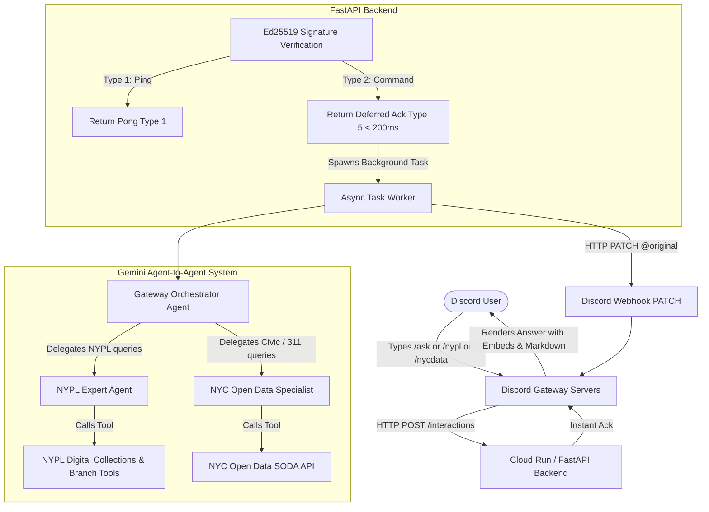

# NYC & NYPL Discord Bot Documentation 📚🤖

Welcome to the documentation for the **NYC & NYPL Discord Bot**, an AI agentic backend built with **FastAPI**, **Google GenAI (Gemini 2.0 Flash)**, and **Discord HTTP Webhooks**, designed to run locally or scale to zero on **Google Cloud Run**.

---

## 📑 Documentation Guide

| Guide | Description |
| :--- | :--- |
| **[High-Level System Explainer](HIGH_LEVEL_EXPLAINER.md)** | Executive summary and comprehensive architecture walkthrough covering multi-channel ingress, A2A delegation, security, and cloud infrastructure. |
| **[Discord User Guide](DISCORD_USER_GUIDE.md)** | Quick-start guide for Discord users explaining available slash commands (`/ask`, `/nypl`, `/nycdata`) and example prompts. |
| **[GCP Deployment Procedural SOP](GCP_DEPLOYMENT_PROCEDURE.md)** | Step-by-step operational runbook and checklist for GCP setup, IAM least-privilege service accounts, Secret Manager, Cloud Run deployment, and verification. |
| **[Local Development Guide](LOCAL_DEVELOPMENT.md)** | Step-by-step instructions for running locally with Python venv, ngrok tunneling, and running automated test suites. |
| **[Discord Bot Setup Guide](DISCORD_BOT_SETUP.md)** | Walkthrough for Discord Developer Portal setup, obtaining credentials (App ID, Public Key, Token), bot permissions, and registering slash commands. |
| **[GCP Setup & Deployment Guide](GCP_SETUP_AND_DEPLOYMENT.md)** | Complete guide for setting up GCP Secret Manager, deploying to Cloud Run with `--no-cpu-throttling`, configuring endpoints, and production maintenance. |
| **[Architecture & Agents Guide](ARCHITECTURE_AND_AGENTS.md)** | Deep dive into the Agent-to-Agent (A2A) orchestration model, Gemini 2.5 Flash tool-calling, SODA SoQL queries, and the Discord 3-second deferred interaction flow. |

---

## 🏗️ Quick Architecture Overview



---

## 🚀 Quick Start (Local in 3 Steps)

1. **Install dependencies**:
   ```bash
   python3 -m venv .venv
   source .venv/bin/activate
   pip install -r requirements.txt
   ```

2. **Configure `.env`**:
   ```bash
   cp .env.example .env
   # Populate GEMINI_API_KEY, DISCORD_APP_ID, DISCORD_PUBLIC_KEY, DISCORD_BOT_TOKEN
   ```

3. **Start local server & run tests**:
   ```bash
   uvicorn app.main:app --reload --port 8080
   python -m unittest discover tests
   ```

For detailed guides, please see the individual documentation files linked above!
